## 直线的表示方法  

### 一般式  
两平面的交线，所以这个直线同时在两个平面上，联立两个平面的方程求解就是直线方程  
$$
    \begin{cases}
        A_1x + B_1y + C_1z + D_1 = 0 \\
        A_2x + B_2y + C_2z + D_2 = 0 \\
    \end{cases}
$$
因为直线同时与两个平面的法向量垂直，此时两个平面的法向量分别为$\vec{a} = (A_1 , B_1 , C_1),\vec{b} = (A_2 , B_2 , C_2)$所以直线的方向向量就是两平面法向量的向量积（叉乘）$\vec{n} = \vec{a} \times \vec{b}$  

### 对称式（点向式）    
$$
    \frac{x-x_0}{l} = \frac{y-y_0}{m} = \frac{z-z_0}{n} 
$$

### 参数式  
如果我们令对称式 = t 则得出参数式  
$$
    \frac{x-x_0}{l} = \frac{y-y_0}{m} = \frac{z-z_0}{n} = t
$$
$$
    x = x_0 + lt, \quad y = y_0 + mt, \quad z = z_0 + nt
$$
对称式，参数式的$(l, m, n)$其实就是直线的方向向量，因为参数式可以看成直线从$(x_0, y_0, z_0)$出发的一条线，那么
$$
    x - x_0 = lt, \quad y - y_0 = mt, \quad z - z_0 = nt
$$
就表示该直线，也就是参数式  

### 求法向量  
先求直线的方向向量$\vec{m} = (a,b,c)$，则根据点乘为0求法向量($\vec{n}$) ，此时 $\vec{n} · \vec{m} = 0$

## 平面方程  

### 一般式  
$$
    Ax + By + Cz + D = 0
$$
此时，平面方程的法向量为$\vec{n} = (A, B, C)$  

### 点法式  
$$
    A(x - x_0) + B(y - y_0) + C(z - z_0) = 0
$$
此时，平面方程的法向量为$\vec{n} = (A, B, C)$  

### 截距式  
$$
    \frac{x}{a} + \frac{y}{b} + \frac{z}{c} = 1
$$
此时平面的法向量为：$\vec{n} = (\frac{1}{a},\frac{1}{b},\frac{1}{c})$

**证明**  
取平面上一点$x_0(a,0,0)$，则有$(\vec{x_0x} = (x-a, y, z)$
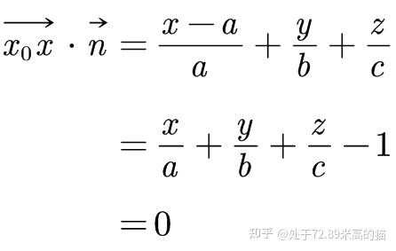  
证毕  

### 点到面距离  
原理： `武忠祥高数基础22 1:04:00`  
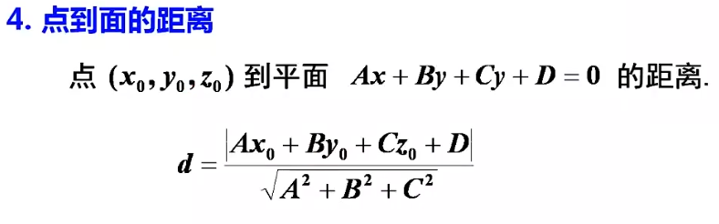   

### 平面与直线的位置关系  
只要看直线的方向向量 $\vec{n}$ 和平面法向量 $\vec{m}$ 之间的关系：  
如果 $\vec{n} · \vec{m} = 0$  则说明方向向量与法向量垂直，此时直线与平面平行  
如果$\vec{n} \times \vec{m} = 0$ ，此时说明方向向量与法向量平行，此时直线与平面垂直，其他情况下直线与平面相交  

## 曲面与空间曲线   

### 曲面方程
一般式  
$$
    F(x,y,z) = 0 \quad 或 \quad z = f(x,y)
$$

#### 旋转面  
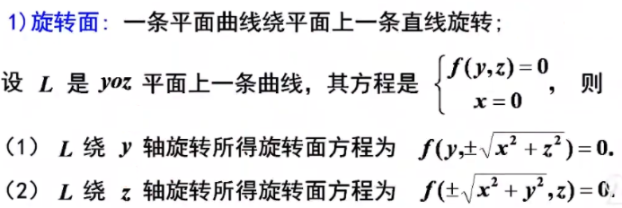  

#### 求旋转面方程  
绕谁转谁就不动  
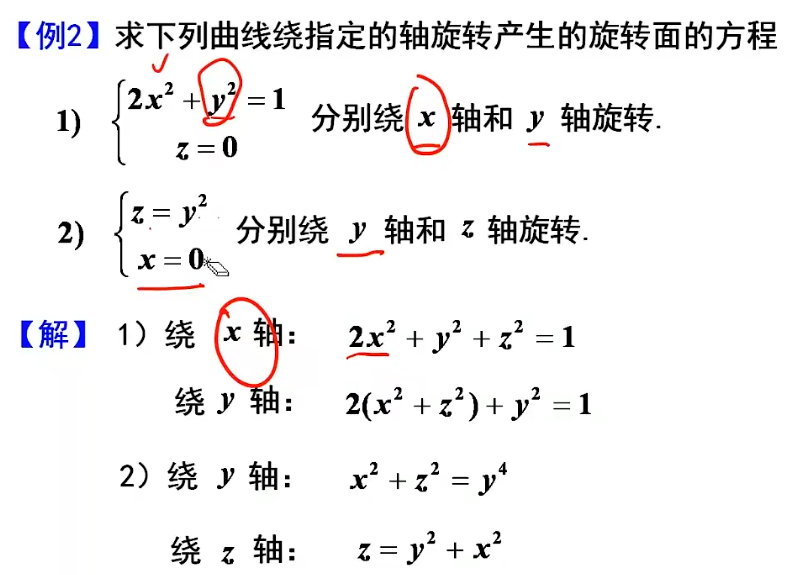  

#### 柱面  
柱面是母线绕准线旋转一周形成的面  
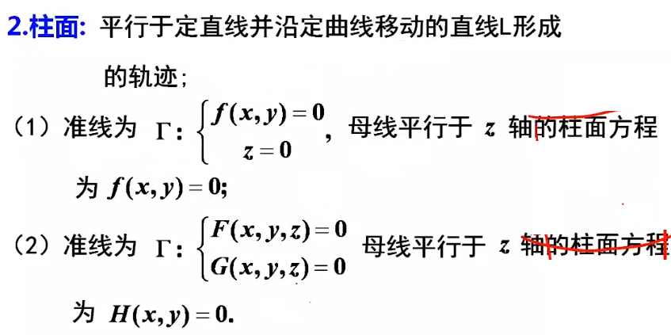  

#### 求柱面方程  
两方程联立消去平行的轴  
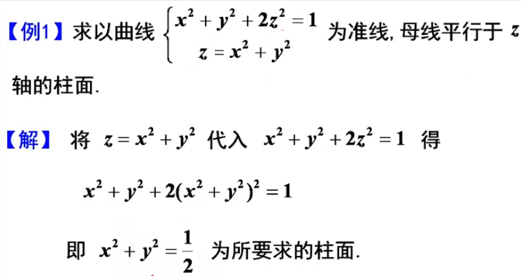  

### 二次曲面  

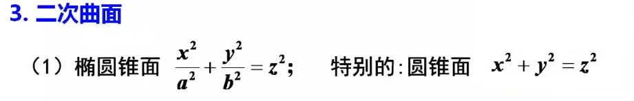  

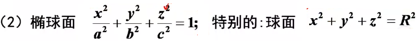  

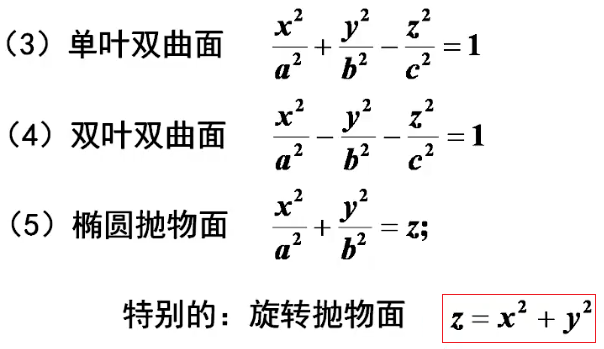  

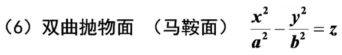

### 空间曲线  

#### 一般式  
两曲面方程的交线的表示形式  
$$
    \begin{cases}
        F(x,y,z) = 0 \\
        G(x,y,z) = 0
    \end{cases}
$$

#### 参数式  
$$
    \begin{cases}
        x = x(t) \\
        y = y(t) \\
        z = z(t)
    \end{cases}
$$

#### 投影曲线  
曲线在面上的投影曲线  

求xoy面上的投影曲线  
1. 先求投影柱面  
2. 根相关的坐标面方程联立(联立z = 0)

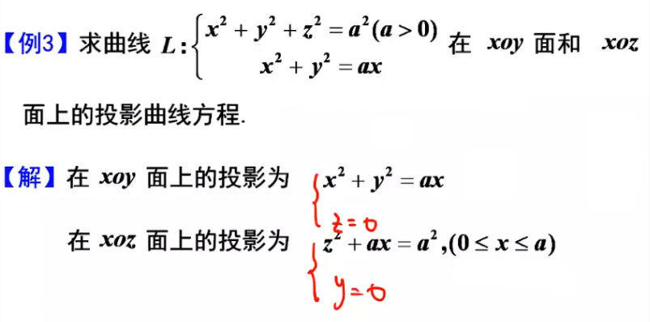  
> xoz 面上的投影的 x 取值范围，需要结合图形分析

