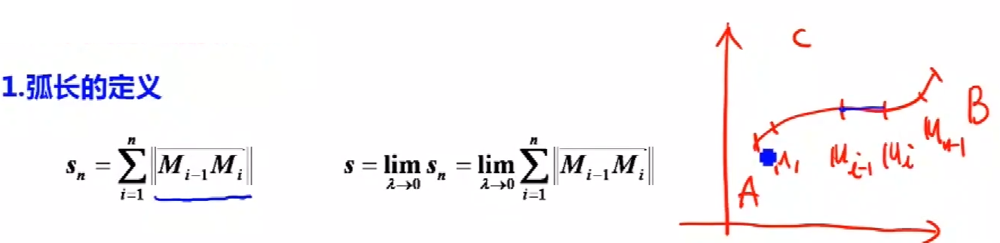
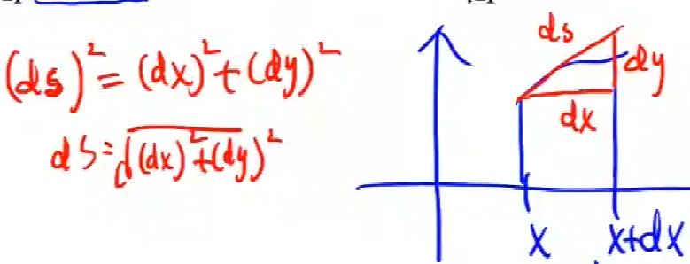

# 曲线积分  

曲线积分就是把一段曲线分成n份，n份之和就是积分，类似于割圆法  

  
$\lambda$是区间的长度  

  

$ds$就是弧长的微分  

所以在直角坐标下：  
$C: y = y(x), y \leq x \leq b$  
$$
    s = \int_a^b ds = \int_a^b \sqrt{(dx)^2 + (dy)^2} =  \int_a^b \sqrt{(dx)^2(1 + (\frac{dy}{dx})^2)} = \int_a^b \sqrt{1 + y'^2}dx
$$

在参数方程条件下：  
$$
    C:\begin{cases}
        x = x(t) \\
        y = y(t) \\
        \end{cases} \quad \alpha \leq t \leq \beta  \\
$$
$$
    s = \int_a^b ds = \int_a^b \sqrt{x'^2 + y'^2} dt 
$$
