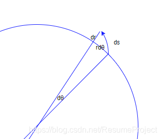

# 积分  

### 一重积分
$$
    \int_{a}^{b} f(x)dx
$$
一重积分的微元是函数值，对函数值的积分在几何上就是对二位面积的积分，所以一重积分积出来的结果是函数与x轴所围成的面积，当积分函数取1时，就相当于对y = 1这条直线在x轴上的积分，此时的值应该等于区间的长  

### 二重积分
$$
    \iint_{D}{} f(x, y) dxdy
$$
二重积分的微元是平面上一块微小的区域，对区域的积分就只能在空间上的第三条轴上积，所以二重积分的几何含义是一个曲面柱体的体积，当被积函数取1时，就相当于在第三条轴z上的值恒取1，或者说放弃了让z轴影响积分结果的可能，此时结果就降维成平面上的积分区间的面积  

### 三重积分
$$
    \iiint_{\Omega}f(x,y,z)dxdydz 
$$
同理，三重积分就是空间上的体积在4维上的积分，积分的结果应该是一个4维图形的体积，如果被积函数取1，那么积分结果表示的就应该是积分区域空间体的体积

## 为什么极坐标情况下的积分区域是  
$$
    \iint_{D}d\sigma = \iint_{D} \rho d \rho d \theta
$$
弧度制下的面积公式：  

$$
    S = \frac{1}{2}\alpha r^2
$$  
所以
$$
    d\sigma = \frac{1}{2}d\theta d\rho^2 \\
$$
化简得：
$$
    d\sigma = \frac{1}{2} 2 \rho d\rho d\theta \\
$$
结果为：
$$
    d\sigma = \rho d\rho d\theta \\
$$

## 积分的计算步骤  
二重积分往后，每一重积分都有积分的次序一说，有的时候对x积分容易积，有的时候对y容易积分，那么怎么知道一个被积函数是哪种类型呢？这时我们需要从**积分区域**和**被积函数**上考虑问题  

### 积分区域对称  
如果积分区域关于x轴对称，那么此时很显然我们应该取积分区域的一半对y积分得出结果并x2,同理积分区域关于y轴对称时取对称的半边对x积分x2  

### 极坐标  
主要用来考虑使用极坐标计算还是直角坐标  
如果被积函数有如下情形：  
$$
    f(\sqrt{x^2 + y^2}), f(\frac{x}{y}), f(\frac{y}{x})
$$
或者积分区域：  
$$
    x^2 + y^2 \leq R^2; \quad
    r^2 \leq x^2 + y^2 \leq R^2; \quad
    x^2 + y^2 \leq 2ax \\
$$
即在几何上是圆，即使圆心不在坐标轴上也可以使用平移 + 极坐标的方法解决  

### 具体步骤  
1. 画域 ：画出积分区域，选择合适的积分次序    
2. 定限 ：确定积分上下限  
3. 计算  
